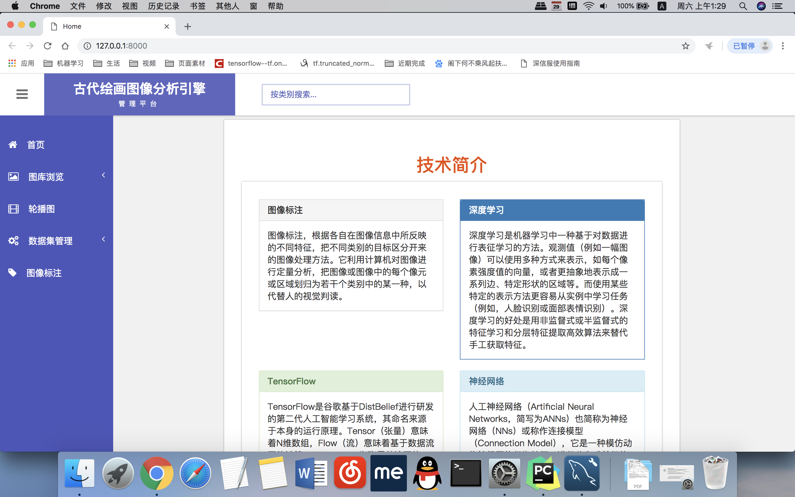
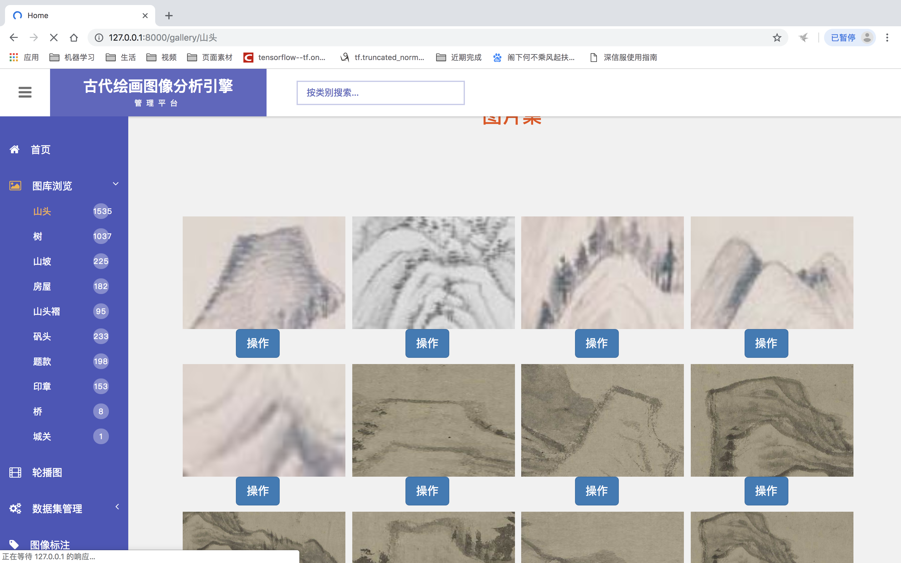
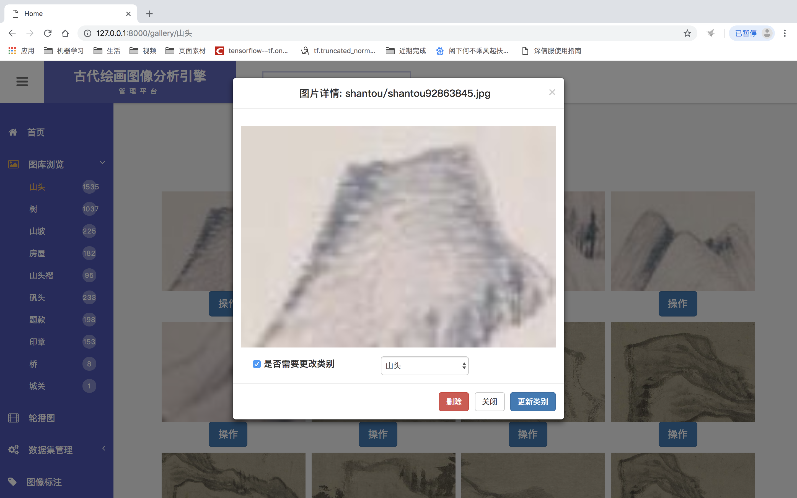
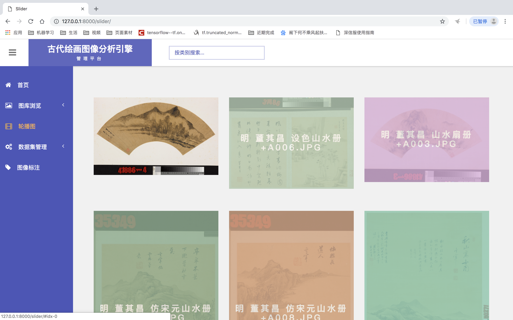
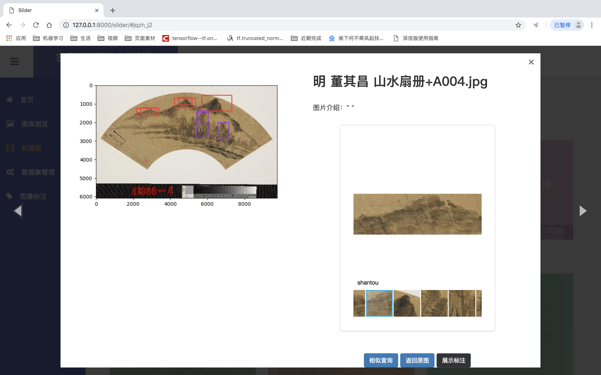
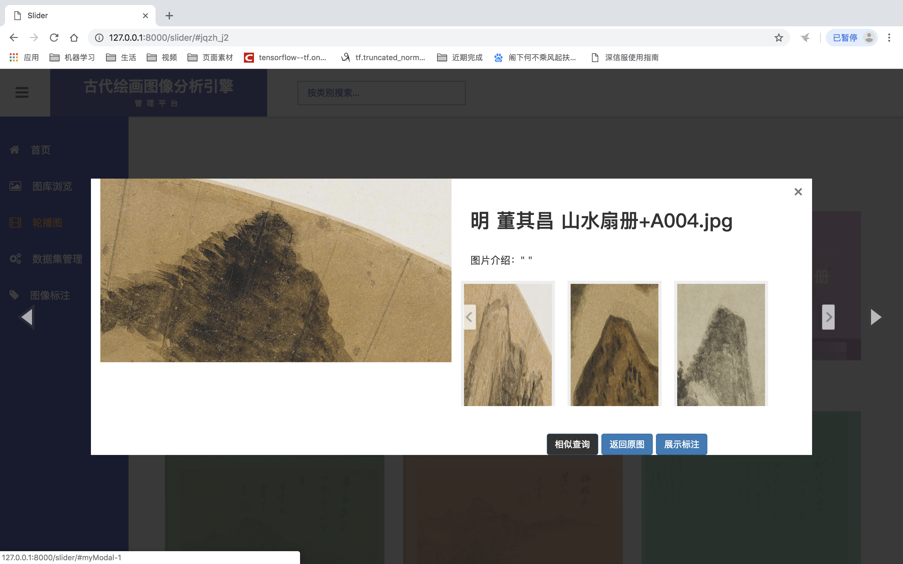
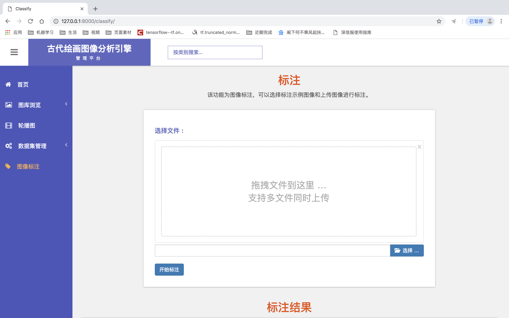

数据库有三个表格:
painting :用来存放大图的信息,大图小图对应关系等
Catagory :用来存放数据库中的类别和数量
Psection :用来存放裁剪的图

imageAnnotation:
settings.py:   ALLOWED_HOSTS 是允许访问的ip      INSTALLED_APPS中需要加入可允许
DATABASES 是数据库的配置信息       STATICFILES_DIRS中加入的是所有app公用动态文件
urls.py    :   from django.conf.urls import url 导入url的写法, url(地址,调用该地址的方法,该地址的 名字)

common_static  :  存放的是页面使用的js和css文件

checkpoints    :  存放的是SSD500生成的模型文件

media          :  这里面存放的是大图和ssd裁剪完的图片,img存放的是原图,pating_img存放的是画完框的原图,其余的文件夹是小图

processing     :  存放的是ssd的一些文件

Annotation     :
models.py:是数据库的表格
utils.py :暂时没有用到,get_all_labels 获取所有标签,get_image_labels 获取所有大图
views.py : 对应的方法在文件中都有介绍,这里就是urls.py所对应的方法,具体介绍代码中有详细介绍

migrations:存放的是数据库的文件
templates :存放页面

因为保密性原因数据不能开放,如果要使用,在Tools 中运行 Run manage.py 首先输入makemigrations    migrate  runserver
然后先在图像标注中上传,iu可以看到ssd识别的效果.上传多张以后可以把所有的小图都取出使用调用       训练相似模型,然后把quanshanshui_index6688替换掉

下面百度云中的内容是图像物体识别的模型，下载下来放到checkpoints文件夹中即可
链接:https://pan.baidu.com/s/12sweJHy5YFUgQIgeESp1BQ  密码:m2e7
程序的界面大体如下：

首页：

图库浏览：

轮播图：

图像识别：

